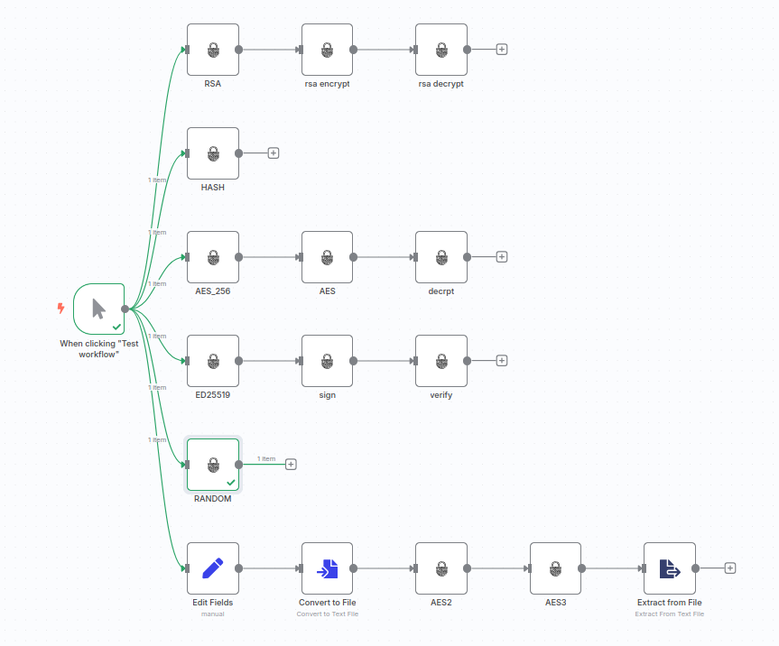
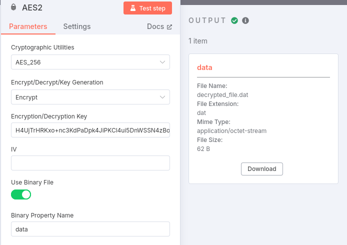
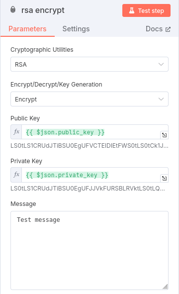

# n8n-nodes-enigma

**Encrypt and decrypt text securely in your n8n workflows using the [Enigma](https://www.npmjs.com/package/@cubbit/enigma) cryptographic library by Cubbit.**

This custom node for [n8n](https://n8n.io) adds support for seamless encryption and decryption operations using modern cryptographic algorithms. It's ideal for protecting sensitive data as it flows through your automated workflows.

---

## ✨ Features

- 🔐 **Encrypt** any text input using secure encryption algorithms
- 🔓 **Decrypt** encrypted values back into readable data
- 🧠 Built on top of the trusted [`@cubbit/enigma`](https://www.npmjs.com/package/@cubbit/enigma) library
- ⚙️ Customizable inputs: define keys, IVs, modes, and more
- 🔁 Supports both binary and string-based operations
- 🧩 Easy integration with any n8n workflow

---

## 🚀 Getting Started

### Prerequisites

Make sure the following are installed on your machine:

- [Git](https://git-scm.com/downloads)
- Node.js `>=18.10` and [pnpm](https://pnpm.io/) `>=9.1`
- n8n (install with: `pnpm install -g n8n`)

> 🧑‍💻 Recommended: [Set up your n8n development environment](https://docs.n8n.io/integrations/creating-nodes/build/node-development-environment/) before you begin.

---

## 🛠️ Installation & Development

1. Clone this repository:
   ```bash
   git clone https://github.com/DangerBlack/n8n-node-enigma.git
   cd n8n-node-enigma
   ```

2. Install dependencies:
   ```bash
   pnpm install
   ```

3. Build the project:
   ```bash
   pnpm build
   ```

4. Open n8n and load the custom node to test it in your workflow.

---

## Example

### Workflow



### AES256 Encrypt



### RSA Encrypt



---

## 📦 Publishing

To publish this node as an npm package:

- Update `package.json` with your metadata.
- Run `pnpm build && pnpm lint`.
- Follow [npm's guide to publishing](https://docs.npmjs.com/packages-and-modules/contributing-packages-to-the-registry).

---

## 📚 Resources

- [n8n Docs – Creating Nodes](https://docs.n8n.io/integrations/creating-nodes/)
- [Enigma by Cubbit – npm page](https://www.npmjs.com/package/@cubbit/enigma)
- [n8n Forum](https://community.n8n.io/)

---

## 🪪 License

MIT © [DangerBlack](https://github.com/DangerBlack)